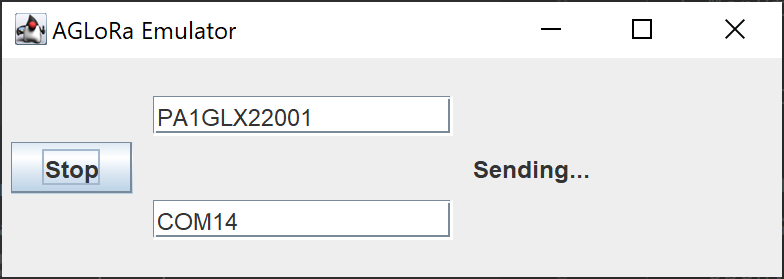

# agloraemulator

Emulator sends serial data as would AGLoRa device do to BLE.
See Full project (C++, PlatformIO): https://github.com/Udj13/AGLoRa-full/
Mobile client (Dart, Flutter): https://github.com/Udj13/AGLoRa-client-flutter

## Usage

To start application correctly you need IntelliJ IDEA CE. Running build from gradle will not work because
of limited support for GUI Designer by Jetbrains and they not gonna improve it (https://youtrack.jetbrains.com/issue/IDEA-223518).
Run application in IDE and specify device id and COM port write data to.

## Contributing

For simple bug reports and fixes, and feature requests, please simply use projects
[Issue Tracker](../../issues)

